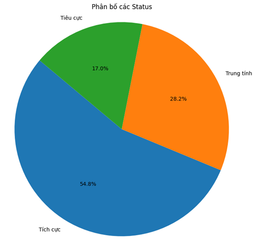

# Tiki Analysis Project

## Overview
This project is a comprehensive analysis system that includes sentiment analysis and spam detection capabilities. It consists of both frontend and backend components, along with Jupyter notebooks for data analysis and model development.

## Project Structure
```
├── frontend/           # Frontend application
├── backend/           # Backend server
├── model_analysis_python/  # Python scripts for model analysis
├── SENTIMENT_ANALYSIS.ipynb  # Sentiment analysis notebook
└── spam_analysis.ipynb      # Spam analysis notebook
```

## Features
- Sentiment Analysis
- Spam Detection
- Interactive Frontend Interface
- Backend API Services
- Data Analysis Notebooks

## Setup Instructions
1. Clone the repository
2. Install dependencies:
   - Frontend: Navigate to `frontend/` and run `npm install`
   - Backend: Navigate to `backend/` and run `pip install -r requirements.txt`
3. Start the services:
   - Frontend: `npm start`
   - Backend: `python app.py`

## Demo Screenshots
You can add your demo screenshots in the following ways:

1. Create a `docs/` directory and place screenshots there:
```
docs/
  ├── screenshots/
  │   ├── frontend-demo.png
  │   ├── analysis-results.png
  │   └── ...
```

## Screenshots

### Data Analysis

*Chart showing the distribution of data statuses*

### API Example

*Example of API response data*

### Application Screenshots


*Various screenshots demonstrating the application interface and functionality*

